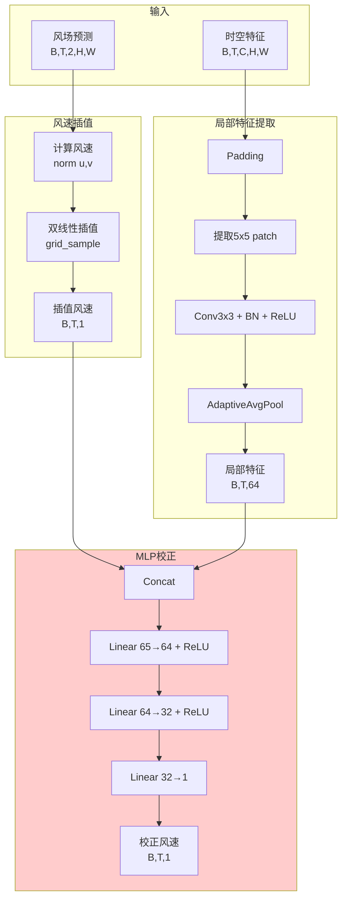
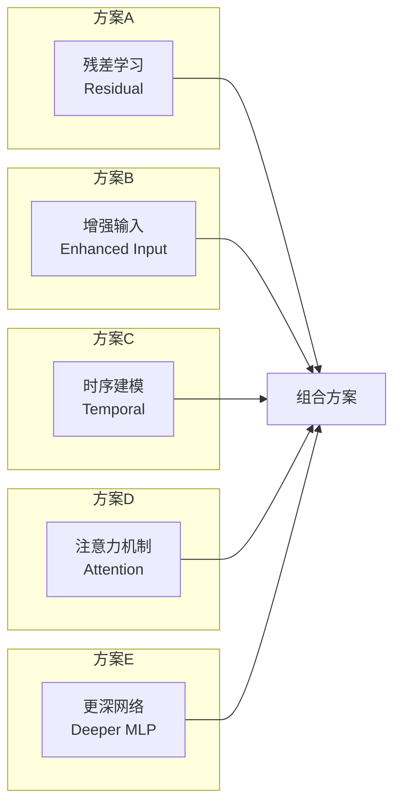
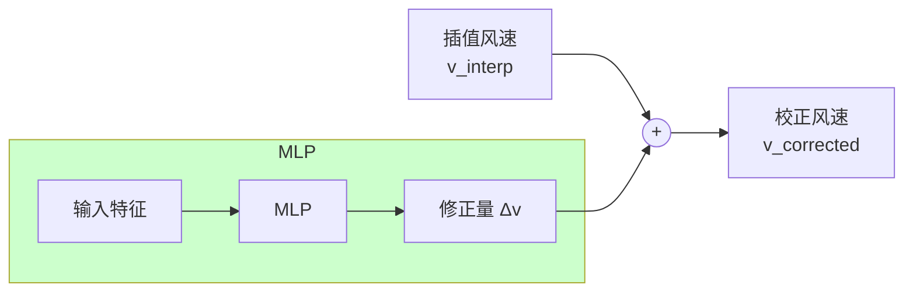
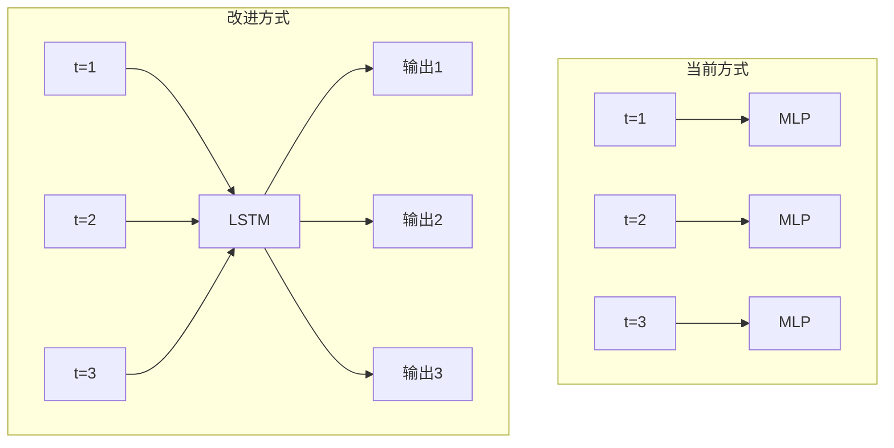
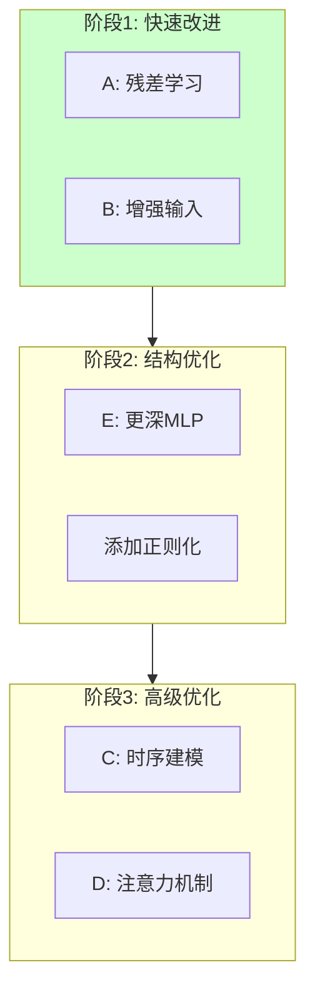
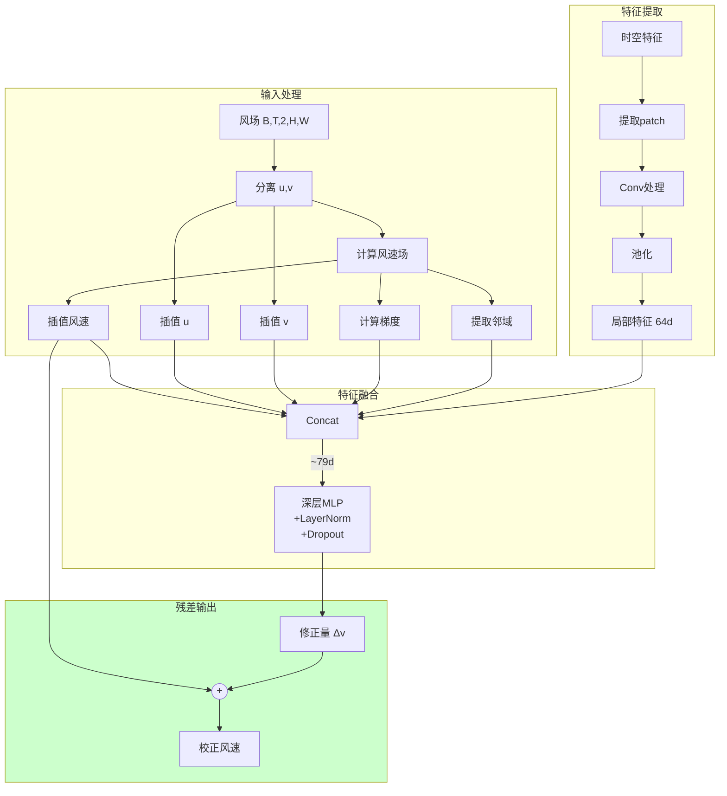
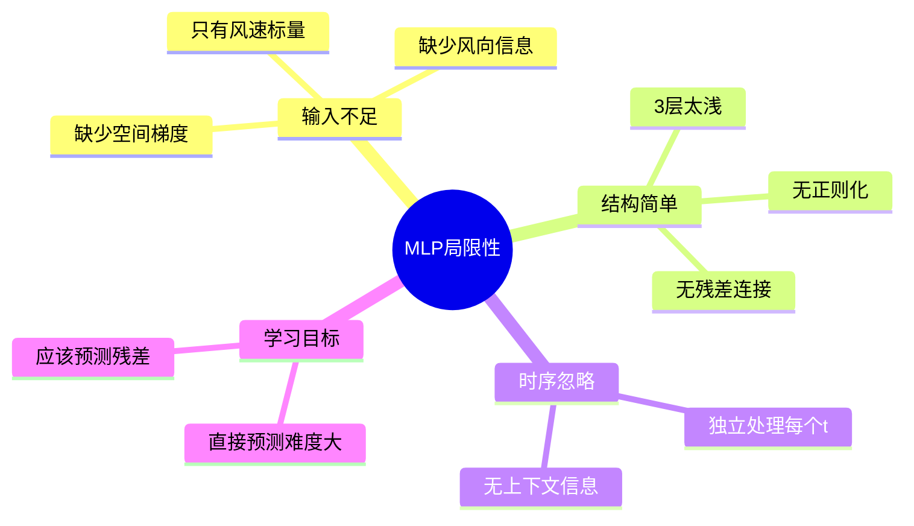
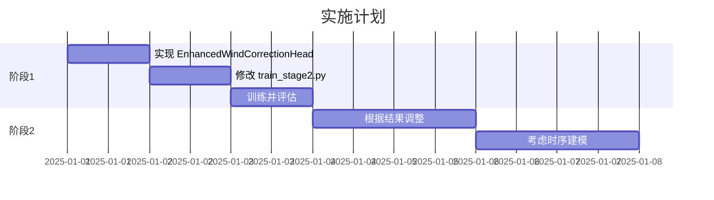

# Stage 2 精确点风速预测技术设计文档

## 1. 问题分析

### 1.1 当前训练结果

```
训练过程:
  Wind loss: 1.0243 → 0.7055 (下降 31%)
  Power loss: 0.0860 → 0.0711 (下降 17%)
  
验证集波动: Val Wind loss 在 0.80-0.91 之间震荡

测试结果:
  Wind Speed - MAE: 2.003 m/s, RMSE: 2.439 m/s
  Power      - MAE: 19.722 MW, RMSE: 22.776 MW
```

### 1.2 问题诊断

| 问题 | 描述 | 严重程度 |
|------|------|----------|
| **Loss 未充分收敛** | Wind loss 停在 0.7 左右，验证集波动大 | 高 |
| **RMSE 偏高** | 2.4 m/s 的误差对于风速预测来说较大 | 高 |
| **MLP 表达能力不足** | 简单 MLP 难以学习复杂的非线性校正映射 | 高 |
| **输入信息不足** | 仅用插值风速 + 局部特征，缺少关键信息 | 中 |

---

## 2. 当前架构分析

### 2.1 现有 WindCorrectionHead 结构



### 2.2 MLP 的局限性分析

**当前 MLP 结构:**
```
Input: [interp_speed(1), local_feat(64)] = 65 维
Hidden1: 64 神经元
Hidden2: 32 神经元
Output: 1 维
```

**问题:**

1. **直接预测 vs 残差预测**
   - 当前：MLP 直接输出校正后的风速
   - 问题：需要同时学习"基础值"和"修正量"，学习负担重
   
2. **缺少时序建模**
   - 当前：每个时间步独立处理
   - 问题：风速具有时间连续性，前后时刻的信息未利用

3. **输入特征不足**
   - 当前输入：插值风速(1维) + 局部特征(64维)
   - 缺失信息：
     - 风向信息 (u, v 分量)
     - 周围点的风速梯度
     - 时间信息 (小时、季节)
     - 气象背景 (温度、气压)

4. **池化丢失空间信息**
   - AdaptiveAvgPool 将 5×5 压缩为 1×1
   - 丢失了风速的空间分布模式

---

## 3. 改进方案对比

### 3.1 方案总览



### 3.2 方案详细设计

#### 方案 A: 残差学习 (推荐 ⭐⭐⭐)

**核心思想:** MLP 只学习修正量 Δv，最终输出 = 插值风速 + Δv

```python
# 当前方式（直接预测）
corrected = self.correction_mlp(mlp_input)  # 学习: f(x) → v_true

# 改进方式（残差预测）
delta = self.correction_mlp(mlp_input)      # 学习: f(x) → Δv
corrected = interp_speed + delta            # v_corrected = v_interp + Δv
```

**优势:**
- 插值风速已经是较好的近似，MLP 只需学习小的修正量
- 训练更稳定，收敛更快
- 即使 MLP 输出为 0，结果也不会太差



#### 方案 B: 增强输入特征 (推荐 ⭐⭐⭐)

**扩展输入维度:**

| 特征 | 维度 | 描述 |
|------|------|------|
| 插值风速 | 1 | 当前使用 |
| u 分量 | 1 | 风向信息 |
| v 分量 | 1 | 风向信息 |
| 风速梯度 | 4 | 上下左右梯度 |
| 周围风速 | 8 | 3×3 邻域 |
| 局部特征 | 64 | 当前使用 |
| **总计** | **79** | |

```python
class EnhancedWindCorrectionHead(nn.Module):
    def forward(self, features, wind_field):
        # 1. 插值 u, v 分量
        u_interp = grid_sample(wind_field[:,:,0:1], grid)
        v_interp = grid_sample(wind_field[:,:,1:2], grid)
        speed_interp = sqrt(u_interp^2 + v_interp^2)
        
        # 2. 计算风速梯度
        speed_field = norm(wind_field, dim=2)
        grad_x = speed_field[:,:,:,1:] - speed_field[:,:,:,:-1]
        grad_y = speed_field[:,:,1:,:] - speed_field[:,:,:-1,:]
        
        # 3. 提取周围点风速 (3x3)
        neighbors = extract_patch(speed_field, coord, size=3)
        
        # 4. 组合所有特征
        mlp_input = concat([
            speed_interp,      # 1
            u_interp,          # 1  
            v_interp,          # 1
            local_gradients,   # 4
            neighbors.flatten, # 8 (去掉中心点=9-1)
            local_feat         # 64
        ])
```

#### 方案 C: 时序建模 (推荐 ⭐⭐)

**问题:** 当前每个时间步独立处理，忽略了风速的时间连续性



**实现方案:**

```python
class TemporalCorrectionHead(nn.Module):
    def __init__(self, ...):
        # 特征提取
        self.feature_mlp = nn.Sequential(...)
        
        # 时序建模
        self.temporal = nn.LSTM(
            input_size=feature_dim,
            hidden_size=64,
            num_layers=2,
            batch_first=True,
            bidirectional=True
        )
        
        # 输出层
        self.output = nn.Linear(128, 1)  # 双向所以是128
```

#### 方案 D: 注意力机制 (推荐 ⭐)

**思路:** 动态选择重要的空间位置和时间步

```python
class AttentionCorrectionHead(nn.Module):
    def __init__(self, ...):
        self.spatial_attn = nn.MultiheadAttention(embed_dim=64, num_heads=4)
        self.temporal_attn = nn.MultiheadAttention(embed_dim=64, num_heads=4)
```

**复杂度较高，可作为后续优化方向**

#### 方案 E: 更深的 MLP (推荐 ⭐)

```python
# 当前: 65 → 64 → 32 → 1
# 改进: 65 → 128 → 128 → 64 → 32 → 1 + Dropout + LayerNorm

self.correction_mlp = nn.Sequential(
    nn.Linear(input_dim, 128),
    nn.LayerNorm(128),
    nn.ReLU(),
    nn.Dropout(0.1),
    
    nn.Linear(128, 128),
    nn.LayerNorm(128),
    nn.ReLU(),
    nn.Dropout(0.1),
    
    nn.Linear(128, 64),
    nn.ReLU(),
    
    nn.Linear(64, 32),
    nn.ReLU(),
    
    nn.Linear(32, 1)
)
```

---

## 4. 推荐实施方案

### 4.1 分阶段实施



### 4.2 阶段1实施: 残差学习 + 增强输入

**改进后的 WindCorrectionHead 架构:**



### 4.3 预期效果

| 指标 | 当前 | 预期改进 | 改进幅度 |
|------|------|----------|----------|
| Wind MAE | 2.003 m/s | < 1.5 m/s | -25% |
| Wind RMSE | 2.439 m/s | < 1.8 m/s | -26% |
| 收敛轮数 | 28 (早停) | < 20 | 更快收敛 |
| 验证集稳定性 | 波动大 | 波动小 | 更稳定 |

---

## 5. MLP vs 其他模型讨论

### 5.1 为什么 MLP 当前效果不佳？



### 5.2 MLP 能否拟合这个问题？

**答案: 可以，但需要改进**

| 因素 | 分析 |
|------|------|
| **数据量** | 265 天 × 24 小时 = 6360 样本，对于 MLP 足够 |
| **问题复杂度** | 风速校正是单点回归问题，MLP 理论上可以拟合 |
| **信息是否充分** | 当前输入信息不足是主要瓶颈 |

**结论:** 
- MLP 本身可以拟合这个问题
- 需要增强输入特征 + 残差学习
- 如果改进后仍不满意，可考虑 LSTM/Transformer

### 5.3 替代方案对比

| 模型 | 优势 | 劣势 | 推荐度 |
|------|------|------|--------|
| **改进MLP** | 简单高效、易调试 | 无时序建模 | ⭐⭐⭐⭐ |
| **LSTM** | 建模时序依赖 | 增加复杂度 | ⭐⭐⭐ |
| **Transformer** | 强大的建模能力 | 需要更多数据 | ⭐⭐ |
| **GNN** | 建模空间关系 | 实现复杂 | ⭐ |

---

## 6. 实施代码

### 6.1 改进的 WindCorrectionHead

```python
class EnhancedWindCorrectionHead(nn.Module):
    """增强版风速校正头：残差学习 + 丰富输入特征"""
    
    def __init__(self, feature_dim: int, turbine_coords: Sequence[Tuple[int, int]], 
                 roi_size: int = 5, hidden_dim: int = 128, 
                 feature_hw: Tuple[int, int] = (64, 80),
                 use_residual: bool = True,
                 dropout: float = 0.1):
        super().__init__()
        self.use_residual = use_residual
        self.roi_size = roi_size
        self.pad = roi_size // 2
        self.feature_hw = feature_hw
        self.turbine_coords = _validate_turbine_coords(turbine_coords, *feature_hw)
        self.num_turbines = len(self.turbine_coords)
        
        # 采样网格
        self._init_sample_grid()
        
        # 局部特征提取
        self.local_conv = nn.Sequential(
            nn.Conv2d(feature_dim, hidden_dim // 2, kernel_size=3, padding=1),
            nn.BatchNorm2d(hidden_dim // 2),
            nn.ReLU(inplace=True),
        )
        self.pool = nn.AdaptiveAvgPool2d(1)
        
        # 增强输入维度: 
        # - 插值风速: 1
        # - u, v 分量: 2
        # - 风速梯度 (上下左右): 4
        # - 3x3邻域 (去中心): 8
        # - 局部特征: hidden_dim // 2
        enhanced_input_dim = 1 + 2 + 4 + 8 + hidden_dim // 2
        
        # 深层 MLP with 正则化
        self.correction_mlp = nn.Sequential(
            nn.Linear(enhanced_input_dim, hidden_dim),
            nn.LayerNorm(hidden_dim),
            nn.ReLU(),
            nn.Dropout(dropout),
            
            nn.Linear(hidden_dim, hidden_dim),
            nn.LayerNorm(hidden_dim),
            nn.ReLU(),
            nn.Dropout(dropout),
            
            nn.Linear(hidden_dim, hidden_dim // 2),
            nn.ReLU(),
            
            nn.Linear(hidden_dim // 2, 1)
        )
        
        # 残差缩放因子 (可学习)
        if use_residual:
            self.residual_scale = nn.Parameter(torch.ones(1) * 0.1)
    
    def _init_sample_grid(self):
        feature_h, feature_w = self.feature_hw
        norm_coords = []
        for h_idx, w_idx in self.turbine_coords:
            y = 2.0 * h_idx / (feature_h - 1) - 1.0
            x = 2.0 * w_idx / (feature_w - 1) - 1.0
            norm_coords.append([x, y])
        grid = torch.tensor(norm_coords, dtype=torch.float32).view(1, self.num_turbines, 1, 2)
        self.register_buffer('sample_grid', grid, persistent=False)
        
        # 3x3 邻域采样网格
        neighbor_coords = []
        for h_idx, w_idx in self.turbine_coords:
            for dh in [-1, 0, 1]:
                for dw in [-1, 0, 1]:
                    if dh == 0 and dw == 0:
                        continue  # 跳过中心点
                    nh = max(0, min(h_idx + dh, feature_h - 1))
                    nw = max(0, min(w_idx + dw, feature_w - 1))
                    y = 2.0 * nh / (feature_h - 1) - 1.0
                    x = 2.0 * nw / (feature_w - 1) - 1.0
                    neighbor_coords.append([x, y])
        neighbor_grid = torch.tensor(neighbor_coords, dtype=torch.float32)
        neighbor_grid = neighbor_grid.view(1, self.num_turbines, 8, 2)
        self.register_buffer('neighbor_grid', neighbor_grid, persistent=False)
    
    def _compute_gradients(self, speed_field, h_idx, w_idx):
        """计算指定位置的风速梯度"""
        b, t, _, h, w = speed_field.shape
        
        # 安全获取邻居值
        def safe_get(hi, wi):
            hi = max(0, min(hi, h-1))
            wi = max(0, min(wi, w-1))
            return speed_field[:, :, 0, hi, wi]
        
        center = safe_get(h_idx, w_idx)
        grad_up = center - safe_get(h_idx - 1, w_idx)
        grad_down = safe_get(h_idx + 1, w_idx) - center
        grad_left = center - safe_get(h_idx, w_idx - 1)
        grad_right = safe_get(h_idx, w_idx + 1) - center
        
        return torch.stack([grad_up, grad_down, grad_left, grad_right], dim=-1)
    
    def forward(self, features: torch.Tensor, wind_field: torch.Tensor) -> dict:
        b, t, c, h, w = features.shape
        device = features.device
        
        # 1. 计算风速场
        speed_field = torch.linalg.norm(wind_field, dim=2, keepdim=True)  # [B,T,1,H,W]
        
        # 2. 插值 u, v, speed
        wind_flat = wind_field.reshape(b * t, 2, h, w)
        speed_flat = speed_field.reshape(b * t, 1, h, w)
        grid = self.sample_grid.to(device).expand(b * t, -1, -1, -1)
        
        u_interp = F.grid_sample(wind_flat[:, 0:1], grid, align_corners=True, mode='bilinear')
        v_interp = F.grid_sample(wind_flat[:, 1:2], grid, align_corners=True, mode='bilinear')
        speed_interp = F.grid_sample(speed_flat, grid, align_corners=True, mode='bilinear')
        
        u_interp = u_interp.view(b, t, self.num_turbines)
        v_interp = v_interp.view(b, t, self.num_turbines)
        speed_interp = speed_interp.view(b, t, self.num_turbines)
        
        # 3. 采样邻域风速
        neighbor_grid = self.neighbor_grid.to(device)
        neighbor_grid = neighbor_grid.view(1, self.num_turbines * 8, 1, 2)
        neighbor_grid = neighbor_grid.expand(b * t, -1, -1, -1)
        neighbors = F.grid_sample(speed_flat, neighbor_grid, align_corners=True, mode='bilinear')
        neighbors = neighbors.view(b, t, self.num_turbines, 8)
        
        # 4. 提取局部特征
        x = features.reshape(b * t, c, h, w)
        x = F.pad(x, (self.pad, self.pad, self.pad, self.pad), mode='replicate')
        
        corrected_outputs = []
        for idx, (h_idx, w_idx) in enumerate(self.turbine_coords):
            # 局部特征
            center_h = h_idx + self.pad
            center_w = w_idx + self.pad
            patch = x[:, :, center_h - self.pad:center_h + self.pad + 1,
                      center_w - self.pad:center_w + self.pad + 1]
            local_feat = self.local_conv(patch)
            pooled = self.pool(local_feat).reshape(b, t, -1)
            
            # 计算梯度
            gradients = self._compute_gradients(speed_field, h_idx, w_idx)
            
            # 组合特征
            point_features = torch.cat([
                speed_interp[:, :, idx:idx+1],     # 插值风速 (1)
                u_interp[:, :, idx:idx+1],         # u 分量 (1)
                v_interp[:, :, idx:idx+1],         # v 分量 (1)
                gradients,                          # 梯度 (4)
                neighbors[:, :, idx, :],           # 邻域 (8)
                pooled                              # 局部特征 (hidden_dim//2)
            ], dim=-1)
            
            # MLP 校正
            delta = self.correction_mlp(point_features.reshape(b * t, -1))
            delta = delta.reshape(b, t, 1)
            
            # 残差输出
            if self.use_residual:
                corrected = speed_interp[:, :, idx:idx+1] + self.residual_scale * delta
            else:
                corrected = delta
            
            corrected_outputs.append(corrected)
        
        corrected_speed = torch.cat(corrected_outputs, dim=2)
        
        return {
            'interp_speed': speed_interp,
            'corrected_speed': corrected_speed
        }
```

---

## 7. 训练策略改进

### 7.1 损失函数

```python
class WindCorrectionLoss(nn.Module):
    def __init__(self, alpha=0.5):
        super().__init__()
        self.alpha = alpha
        self.mse = nn.MSELoss()
        self.mae = nn.L1Loss()
    
    def forward(self, pred, target):
        # 组合 MSE 和 MAE (Huber-like)
        mse_loss = self.mse(pred, target)
        mae_loss = self.mae(pred, target)
        return self.alpha * mse_loss + (1 - self.alpha) * mae_loss
```

### 7.2 学习率调度

```python
# 使用 CosineAnnealing with Warmup
scheduler = torch.optim.lr_scheduler.CosineAnnealingWarmRestarts(
    optimizer, T_0=10, T_mult=2, eta_min=1e-6
)
```

### 7.3 数据增强

```python
# 时间维度的数据增强
def augment_temporal(grid_input, wind_target, power_target):
    # 随机时间偏移
    if random.random() < 0.3:
        shift = random.randint(-2, 2)
        grid_input = torch.roll(grid_input, shift, dim=1)
        wind_target = torch.roll(wind_target, shift, dim=1)
        power_target = torch.roll(power_target, shift, dim=1)
    return grid_input, wind_target, power_target
```

---

## 8. 总结

### 8.1 关键改进点

1. **残差学习**: MLP 只学习修正量，而非直接预测风速
2. **增强输入**: 添加 u/v 分量、梯度、邻域信息
3. **更深网络**: 增加层数 + LayerNorm + Dropout
4. **改进损失**: MSE + MAE 组合损失

### 8.2 下一步行动



### 8.3 预期目标

- Wind Speed MAE < 1.5 m/s
- Wind Speed RMSE < 1.8 m/s
- 训练稳定收敛，验证集无大波动
