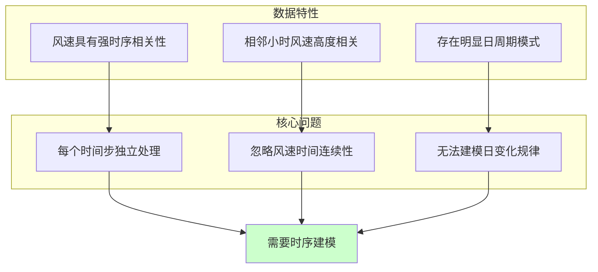
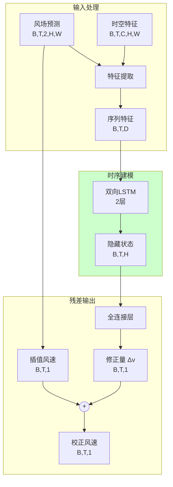
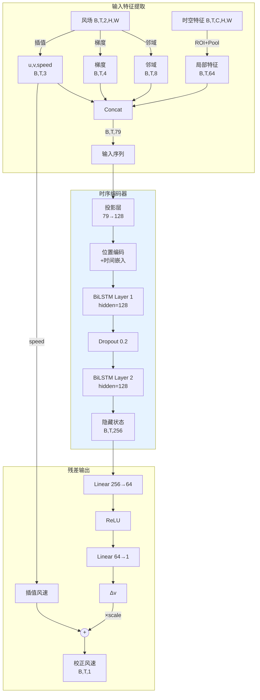
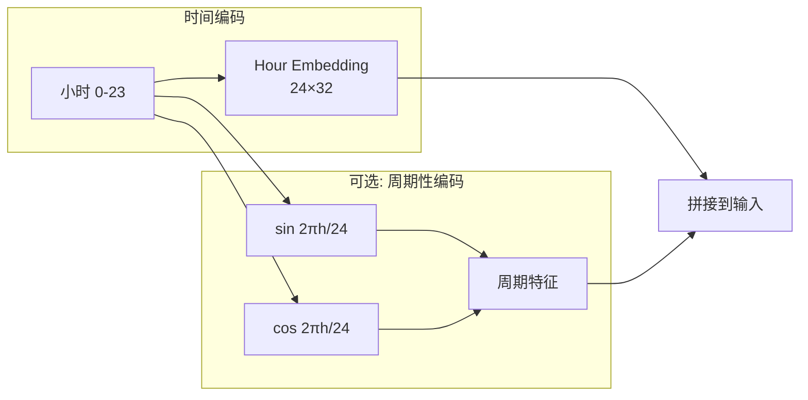
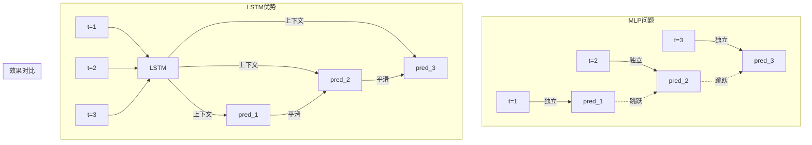
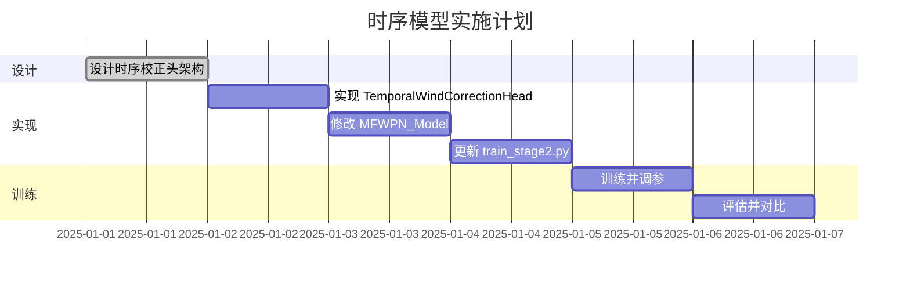

# Stage 2 精确点风速预测 - 时序建模方案

## 1. 问题回顾

### 1.1 阶段1实验结果

| 方案 | Wind MAE | Wind RMSE | 改进幅度 |
|------|----------|-----------|----------|
| 原始 MLP | 2.003 m/s | 2.439 m/s | - |
| 残差+增强输入 | 1.925 m/s | 2.442 m/s | **-3.9%** |

**结论**: 残差学习+增强输入改进有限，核心问题未解决。

### 1.2 问题诊断



### 1.3 从 CSV 观察到的问题

```
2025-08-17 数据:
Hour  Pred   True   Error
1     8.38   4.71   +3.68   ← 系统性高估
2     7.83   3.82   +4.01
...
10    8.54   3.04   +5.50   ← 白天误差更大
11    9.04   2.45   +6.59
12    9.07   2.20   +6.88
...
21    7.31   8.61   -1.30   ← 晚间开始低估
```

**观察**: 预测值变化平缓，真实值变化剧烈 → MLP 无法捕捉时序动态

---

## 2. 时序建模方案设计

### 2.1 整体架构



### 2.2 为什么选择 LSTM？

| 特性 | MLP | LSTM | Transformer |
|------|-----|------|-------------|
| 时序建模 | ❌ | ✅ | ✅ |
| 长距离依赖 | ❌ | ✅ | ✅✅ |
| 参数量 | 少 | 中 | 多 |
| 数据需求 | 少 | 中 | 多 |
| 训练稳定性 | ✅✅ | ✅ | 需调参 |
| **推荐度** | - | **⭐⭐⭐⭐** | ⭐⭐ |

**选择 LSTM 的理由**:
1. 风速预测是典型的时序回归问题
2. 数据量有限 (265天)，Transformer 可能过拟合
3. 24小时序列长度适中，LSTM 足够处理
4. 双向 LSTM 可同时利用前后文信息

---

## 3. 详细设计

### 3.1 TemporalWindCorrectionHead 架构



### 3.2 核心代码设计

```python
class TemporalWindCorrectionHead(nn.Module):
    """时序风速校正头：LSTM建模时间依赖"""
    
    def __init__(
        self,
        feature_dim: int,
        turbine_coords: Sequence[Tuple[int, int]],
        roi_size: int = 5,
        hidden_dim: int = 128,
        lstm_layers: int = 2,
        lstm_hidden: int = 128,
        dropout: float = 0.2,
        bidirectional: bool = True,
        use_time_embedding: bool = True,
        feature_hw: Tuple[int, int] = (64, 80)
    ):
        super().__init__()
        
        # 特征提取 (与增强版相同)
        self.feature_extractor = EnhancedFeatureExtractor(...)
        
        # 输入投影
        input_dim = 3 + 4 + 8 + feature_dim  # u,v,speed + grad + neighbors + local
        self.input_proj = nn.Linear(input_dim, hidden_dim)
        
        # 时间嵌入 (可选)
        if use_time_embedding:
            self.hour_embedding = nn.Embedding(24, hidden_dim // 4)
            lstm_input_dim = hidden_dim + hidden_dim // 4
        else:
            lstm_input_dim = hidden_dim
        
        # 双向 LSTM
        self.lstm = nn.LSTM(
            input_size=lstm_input_dim,
            hidden_size=lstm_hidden,
            num_layers=lstm_layers,
            batch_first=True,
            dropout=dropout if lstm_layers > 1 else 0,
            bidirectional=bidirectional
        )
        
        # 输出层
        lstm_output_dim = lstm_hidden * (2 if bidirectional else 1)
        self.output_head = nn.Sequential(
            nn.Linear(lstm_output_dim, hidden_dim // 2),
            nn.ReLU(),
            nn.Dropout(dropout),
            nn.Linear(hidden_dim // 2, 1)
        )
        
        # 残差缩放
        self.residual_scale = nn.Parameter(torch.ones(1) * 0.1)
    
    def forward(self, features, wind_field):
        b, t, c, h, w = features.shape
        
        # 1. 提取增强特征 (每个时间步)
        point_features = self.feature_extractor(features, wind_field)  # [B, T, D]
        
        # 2. 投影
        x = self.input_proj(point_features)  # [B, T, hidden_dim]
        
        # 3. 添加时间嵌入
        if hasattr(self, 'hour_embedding'):
            hours = torch.arange(t, device=x.device)
            hour_emb = self.hour_embedding(hours)  # [T, hidden_dim//4]
            hour_emb = hour_emb.unsqueeze(0).expand(b, -1, -1)
            x = torch.cat([x, hour_emb], dim=-1)
        
        # 4. LSTM 时序建模
        lstm_out, _ = self.lstm(x)  # [B, T, lstm_hidden*2]
        
        # 5. 输出修正量
        delta = self.output_head(lstm_out)  # [B, T, 1]
        
        # 6. 残差输出
        interp_speed = self.get_interp_speed(wind_field)  # [B, T, 1]
        corrected = interp_speed + self.residual_scale * delta
        
        return {
            'interp_speed': interp_speed.squeeze(-1),
            'corrected_speed': corrected.squeeze(-1)
        }
```

### 3.3 时间嵌入设计



**时间嵌入的作用**:
- 让模型知道当前是哪个小时
- 学习日变化规律（白天/夜晚风速差异）
- 捕捉周期性模式

---

## 4. 训练策略

### 4.1 损失函数

```python
class TemporalCorrectionLoss(nn.Module):
    """时序校正损失：MSE + 平滑约束"""
    
    def __init__(self, smooth_weight=0.1):
        super().__init__()
        self.smooth_weight = smooth_weight
    
    def forward(self, pred, target):
        # 主损失: MSE
        mse_loss = F.mse_loss(pred, target)
        
        # 平滑约束: 预测的时间变化应与真实值相似
        pred_diff = pred[:, 1:] - pred[:, :-1]
        target_diff = target[:, 1:] - target[:, :-1]
        smooth_loss = F.mse_loss(pred_diff, target_diff)
        
        return mse_loss + self.smooth_weight * smooth_loss
```

### 4.2 训练参数

| 参数 | 值 | 说明 |
|------|-----|------|
| LSTM hidden | 128 | 隐藏层维度 |
| LSTM layers | 2 | 层数 |
| Bidirectional | True | 双向 |
| Dropout | 0.2 | 防过拟合 |
| Learning rate | 1e-3 | 初始学习率 |
| Scheduler | CosineAnnealing | 余弦退火 |
| Batch size | 8 | 批大小 |
| Epochs | 100 | 最大轮数 |
| Early stopping | 15 | 耐心值 |

### 4.3 数据增强

```python
def temporal_augmentation(grid_input, wind_target, power_target):
    """时序数据增强"""
    
    # 1. 随机时间翻转 (双向LSTM可以处理)
    if random.random() < 0.3:
        grid_input = torch.flip(grid_input, dims=[1])
        wind_target = torch.flip(wind_target, dims=[0])
        power_target = torch.flip(power_target, dims=[0])
    
    # 2. 添加高斯噪声
    if random.random() < 0.5:
        noise = torch.randn_like(grid_input) * 0.05
        grid_input = grid_input + noise
    
    return grid_input, wind_target, power_target
```

---

## 5. 预期效果

### 5.1 改进预期

| 指标 | 原始 MLP | 增强 MLP | **时序 LSTM** |
|------|----------|----------|---------------|
| Wind MAE | 2.003 m/s | 1.925 m/s | **< 1.5 m/s** |
| Wind RMSE | 2.439 m/s | 2.442 m/s | **< 2.0 m/s** |
| 时序平滑度 | 差 | 差 | **好** |
| 日变化捕捉 | ❌ | ❌ | **✅** |

### 5.2 为什么时序模型会更好？



**LSTM 能够:**
1. 利用前几个小时的风速趋势
2. 预测未来几个小时的变化方向
3. 产生更平滑、更符合物理规律的预测
4. 学习日周期模式（早晨风速上升、傍晚下降等）

---

## 6. 实施计划



---

## 7. 与原方案对比

| 方面 | MLP 方案 | LSTM 方案 |
|------|----------|-----------|
| **时序建模** | ❌ 无 | ✅ 双向 LSTM |
| **参数量** | ~20K | ~150K |
| **训练时间** | 快 | 中等 |
| **推理延迟** | 低 | 稍高 |
| **预期精度** | MAE 1.9 m/s | MAE < 1.5 m/s |
| **输出平滑度** | 跳跃 | 平滑 |
| **日周期捕捉** | ❌ | ✅ |

---

## 8. 总结

**核心改进**: 用双向 LSTM 替代 MLP，建模风速的时间依赖关系

**关键设计**:
1. **双向 LSTM**: 同时利用过去和未来信息
2. **时间嵌入**: 编码小时信息，学习日周期
3. **残差学习**: 保持不变，MLP 已验证有效
4. **平滑损失**: 约束预测的时间一致性

**预期收益**:
- Wind MAE 下降 20%+ (从 1.9 → <1.5 m/s)
- 预测曲线更平滑，更符合物理规律
- 能够捕捉日变化模式
