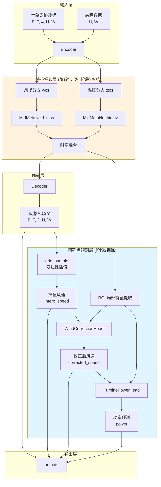
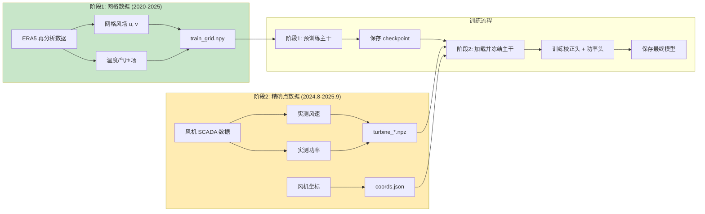
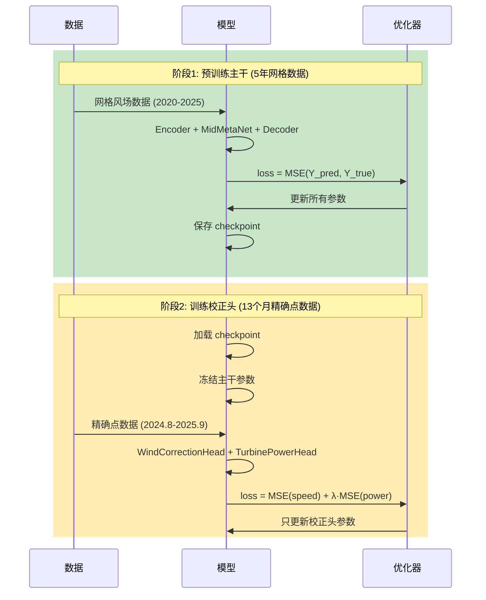
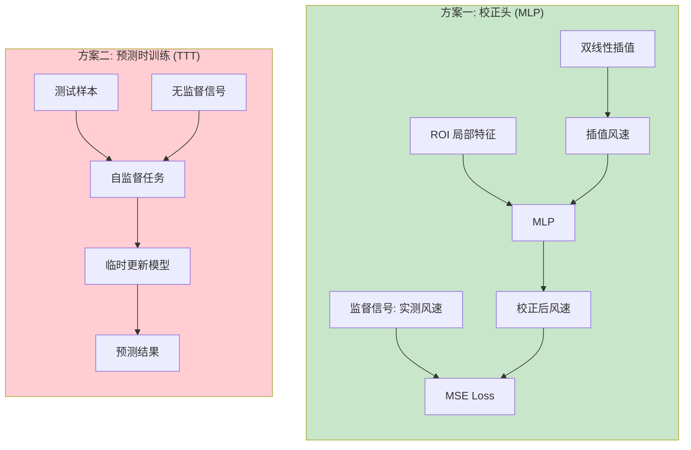
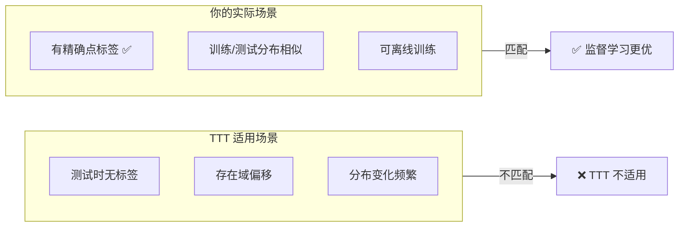
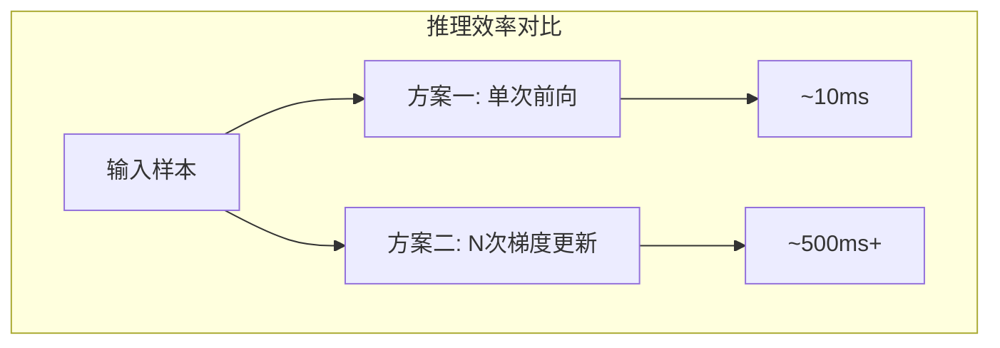
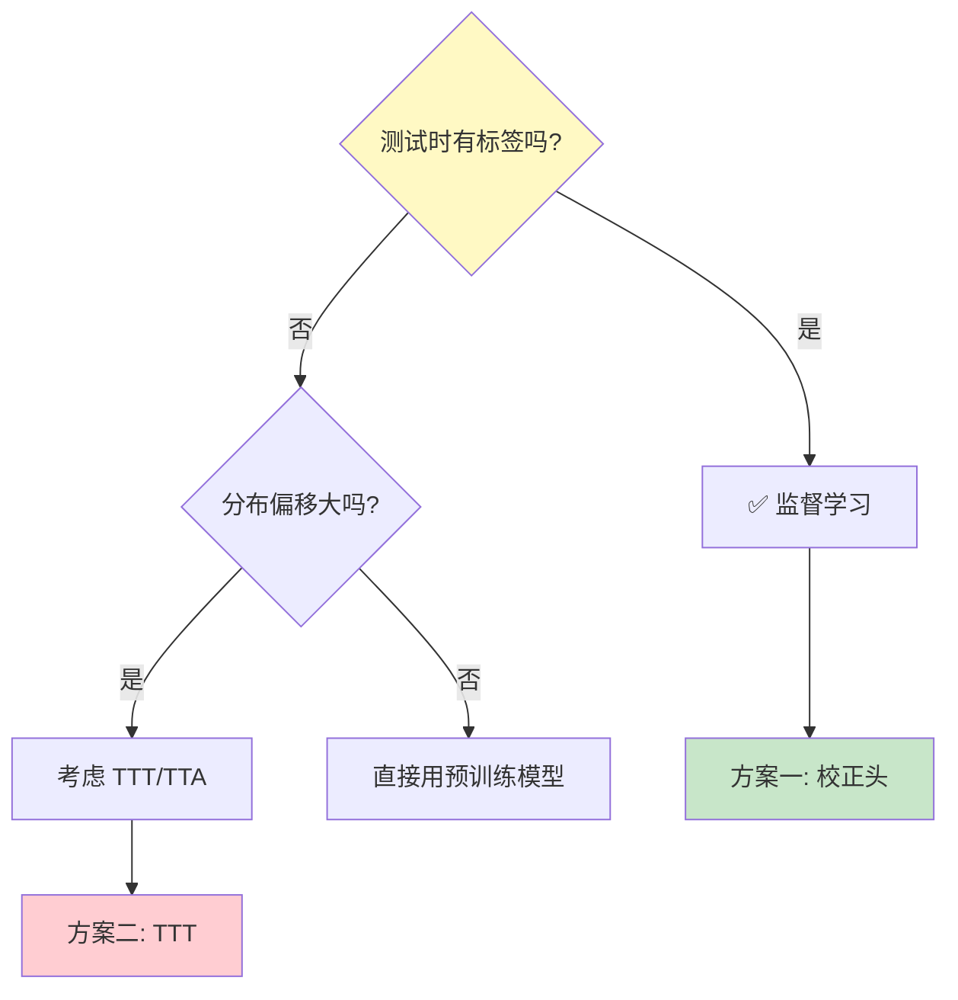

# MFWPN 版本迭代文档

## 版本概览

| 版本 | 日期 | 核心变更 |
|------|------|----------|
| v1.0 | 2025.01 | 基础网格风场预测 (u, v 分量) |
| v2.0 | 2025.12 | 新增精确点风速校正 + 功率预测 |

---

## 总体架构流程图



---

## 数据流程图



---

## 两阶段训练流程



---

## 方案选择分析

### 需求回顾

**问题**：双线性插值得到的风速与精确位置实际风速差别较大，需要预测精确点的真实风速。

**候选方案**：
1. **方案一**：插值后加 MLP 校正头
2. **方案二**：预测时训练 (Test-Time Training, TTT)

---

### 方案对比



---

### 为什么选择方案一而非方案二？

#### 1. 监督信号可用性

| 方面 | 方案一 (校正头) | 方案二 (TTT) |
|------|-----------------|--------------|
| **监督信号** | ✅ 有精确点实测风速 | ❌ 需要自监督信号 |
| **标签质量** | 高质量直接监督 | 间接/代理任务 |
| **学习目标** | 直接学习插值→真值映射 | 学习辅助任务，间接改善 |

**结论**：你的场景**有精确点标签**（虽然时间短），直接监督学习比自监督更高效、更准确。

---

#### 2. 适用场景分析



**TTT 典型用例**：
- 图像分类中测试图像风格变化（如医疗影像不同设备）
- 自动驾驶中遇到训练时未见过的天气

**你的场景**：
- 测试时精确点数据与训练时来自**同一批风机**
- 不存在显著的域偏移，只是插值误差问题

---

#### 3. 数据量与效率

| 方面 | 方案一 (校正头) | 方案二 (TTT) |
|------|-----------------|--------------|
| **训练数据需求** | 13 个月精确点数据足够 | 无需训练数据，但每次推理都要微调 |
| **推理速度** | 快 (单次前向传播) | 慢 (每样本需多次梯度更新) |
| **部署复杂度** | 简单 | 复杂 (推理时需要梯度计算) |



---

#### 4. 技术实现复杂度

| 方面 | 方案一 (校正头) | 方案二 (TTT) |
|------|-----------------|--------------|
| **实现难度** | 低 (标准监督学习) | 高 (需设计自监督任务) |
| **调参复杂度** | 标准超参 | 需调自监督任务权重、更新步数等 |
| **可解释性** | 高 (直接校正) | 低 (间接影响) |
| **稳定性** | 高 | 可能不稳定 |

---

#### 5. 决策树



**你的路径**：有标签 → 监督学习 → 方案一

---

### 方案一的优势总结

| 优势 | 说明 |
|------|------|
| **直接监督** | 用实测风速直接训练，学习效率高 |
| **两阶段训练** | 充分利用 5 年网格数据 + 13 个月精确点数据 |
| **推理高效** | 无需推理时梯度计算 |
| **可扩展** | 易于加入更多精确点 |
| **可解释** | 校正量可直接分析 |

---

### 方案二的潜在价值（未来考虑）

如果未来遇到以下情况，可考虑 TTT：
1. 新增风机**无历史数据**
2. 气候模式**显著变化**（如极端天气）
3. 需要**在线自适应**

---

## 版本 v2.0 变更清单

### 新增模块

| 模块 | 文件 | 功能 |
|------|------|------|
| `WindCorrectionHead` | `mfwpn.py:25-115` | 校正插值风速 |
| `TurbinePowerHead` 更新 | `mfwpn.py:118-221` | 支持校正风速输入 |

### 新增参数

```python
MFWPN_Model(
    turbine_coords=[(h, w), ...],        # 精确点网格坐标
    enable_wind_correction=True,          # 启用风速校正
    wind_correction_hidden=64,            # 校正头隐藏维度
    use_corrected_speed_for_power=True,   # 功率头使用校正风速
)
```

### 新增输出

```python
outputs = {
    'wind': [B, T, 2, H, W],              # 网格风场 (原有)
    'interp_speed': [B, T, N],            # 插值风速 (新增)
    'corrected_speed': [B, T, N],         # 校正风速 (新增)
    'power': [B, T, N, 1],                # 功率预测 (新增)
}
```

### 新增文档

| 文档 | 路径 |
|------|------|
| 技术文档 | `docs/turbine_point_prediction.md` |
| 版本迭代 | `docs/version_changelog.md` |

---

## 后续迭代计划

| 版本 | 预计内容 |
|------|----------|
| v2.1 | 多风机联合建模、功率曲线物理约束 |
| v2.2 | 不确定性量化、概率预测 |
| v3.0 | 支持 TTT 自适应（针对新风机场景） |
